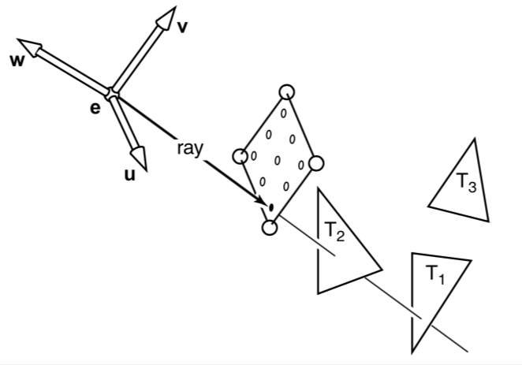
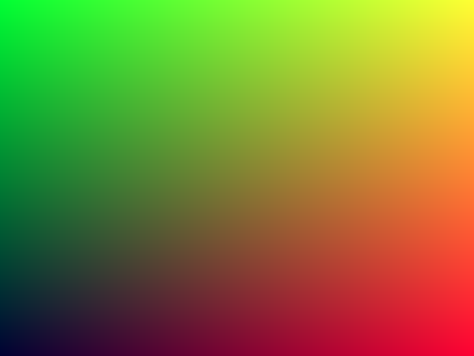

__COMPUTER GRAPHICS I (DIM0451)  --  Ray Tracer Project__

# Project 1 - Basic Infrastructure

In this programming project you will begin writing your own ray tracer.

We've learned from the lessons so far that a basic ray tracing algorithm works by shooting **rays** through **pixels** of an image into a **scene**; every time a ray hits something in the scene, the algorithm triggers some form of **shader** (aka _reflectance model_) to determine the color of that pixel. By **shader** we mean another class or procedure, **physically based** or otherwise, that might shoot other rays, stop on the first hit (i.e. a _ray casting_), compute the contribution of the **lights** in the scene, for example, to determine and return a [_rgb_ color](https://en.wikipedia.org/wiki/RGB_color_model) (see figure below, from Chapter 4 of _"Fundamentals of Computer Graphics"_, 3rd ed., Shirley and Marschner).




At this point, several of the ray tracing components mentioned above are to be considered **black boxes**. For now, our major concern is to understand the _"big picture"_ and lay down the foundations of our ray tracing, which, in turn, will be extended and experimented with along the next projects.

## Requirements

We'll start with the basic elements of a ray tracer, namely
1. A class `Film` that stores pixels values as an **image color buffer** (a matrix). This allows the ray tracer to save the color buffer to an image file in PPM or PNG format. The class is named `Film` because it plays a role similar to a film in an analog camera, or sensor in a modern digital camera.
2. A class `Background` that is responsible for returning a color each time the primary ray misses any object in the scene (i.e. hits nothing). In this project, this class will receive a _raster coordinate_ $`(i,j)`$ and return the corresponding background color.
3. A set of classes to handle the math operations on vectors and matrices. In this case you might either implement your own library (`Vector3`, `Point3`, `Mat3x3`, etc.) based on the one provided in [_"Ray Tracing in One Weekend"_](https://github.com/petershirley/raytracinginoneweekend/releases/), or adopt other math libraries such as [_OpenGL Mathematics_](https://glm.g-truc.net/0.9.9/index.html), or [_cyCodeBase_](http://www.cemyuksel.com/cyCodeBase/code.html).
4. The `API class` which is a [singleton](https://en.wikipedia.org/wiki/Singleton_pattern) that can be coded as a static class that will instantiate and keep track of all object that we will need to run the ray tracer. In this project, for instance, this class should hold an instance of `Background`, and `Film`, and provide a method `render()` in which resides the main loop described next.
5. The _main loop_ of the  ray tracing algorithm, which should traverse the image pixels and shoot rays into the scene. At this stage, the main loop only traverses the image and samples colors from the `Background` object. (no rays are shot just yet)
6. A set of functions that _parses_, i.e. reads in and validates a scene description file in XML with the format explained below, extracts the information necessary to set up the other classes, and sends these to the `API class` via its static methods. 

The suggested flux of information for the project inside the `main()` function is the following:

1.  Reads the _command line arguments_ and stores them into a `struct RunningOptions`. This struct may be defined in a globally visible header file, such as `rt3.h`. The command line arguments are:
```
Usage: rt3 [<options>] <input_scene_file>
    Rendering simulation options:
        --help                     Print this help text.
        --cropwindow <x0,x1,y0,y1> Specify an image crop window.
        --quick                    Reduces quality parameters to render image quickly.
        --outfile <filename>       Write the rendered image to <filename>.
```
> + Name of the input scene file. **[required]**
> + crop window: this arguments defines a sub-window to be rendered instead of the full image. **[optional]**
> + quick render: this is a Boolean flag that triggers the rendering of a image with 1/4 of it original resolution. **[optional]**
> + Name of the image output file (this overwrites the file informed in the XML scene file). **[optional]**

2.  Calls the method `API::init_engine(const RunningOptions &opt)`. This method stores the running options and initialize the API's internal states (graphics state). _[Not necessary in this project]_
3.  Calls the method  `API::run()`. This method just calls the the static function `parse(opt.file_name)`. This function, in turn, does the following:
	1.  traverses the XML file, identifying each possible tag available in RT3;
	2.  collects each the tag's attributes and packing them into a bundle (a `ParamSet class` object);
	3.  sends the bundle object (parameters) to the proper API static method. Ex.: `API::background(...)`, and;
	4. when it finds the `world_end` tag it calls the `render()` method that implements the classical ray tracing loop.
4. Calls the method `API::clean_up()`, this frees all the resources previously allocated.

## The Scene Format

Here we provide a basic XML format for describing the scene. Keep it in mind that upcoming projects will have additional tags that we will define when we need them.

Here is an example scene file:
```xml
<RT3>
    <camera type="orthographic" />
    <film type="image" x_res="200" y_res="100" filename="simple_bkg.ppm" img_type="ppm" />
    <world_begin/>
        <background type="colors" color="153 204 255"/>
    <world_end/>
</RT3>
```

The output may be find [here](pics/simple_bkg.ppm).

All elements are declared inside a `RT3` tag. _You might want to replace this tag with you ray tracer program name._ At this stage, we only have a few tags, `background`, `camera`, `film`, `world_begin`, and `world_end`. Later on we will add `object`, `light`, `material`, etc. In this project, however, you may simply ignore the `camera` tag since we are not creating cameras just yet.

In the example above, we (implicitly) asked for a solid background whenever a single color is provided (in this case, a light blue sky) for the entire background, via the `color` attribute. However, if the scene file provides 2 or more colors, it means your ray tracer needs to interpolate the colors to generate the background. It is possible to specify a color for each of the four corners of the screen, as follows:

* `bl`, bottom-left corner of the screen;
* `tl`, top-left corner of the screen;
* `tr`, top-right corner of the screen, and;
* `br`, bottom-right corner of the screen.

You may assume a black color (RGB=(0,0,0)) for any unspecified/absent corners in the scene file, since we always need 4 colors. 

Given these color, your ray tracer should apply [**bilinear interpolation**](https://en.wikipedia.org/wiki/Bilinear_interpolation) when sampling the background. You may want to provide a method with the following prototype:
```c++
rgb Background::sample( float i, float j );
// or
rgb Background::sample( const Point2f& raster );
```
where `rgb` means a color in the three-dimensional RBG space, and `i` and `j` are values in $`[0,1]`$ corresponding to the _normalized_ location of the pixel `(i,j)` in the color buffer. 

Here is another example, this time asking for a background generated through interpolation.

```xml
<RT3>
    <camera type="orthographic" />
    <film type="image" x_res="800" y_res="600" filename="interpolated_bkg.png" img_type="png" />
    <world_begin/>
        <!-- This defines an interpolated background -->
        <background type="colors" mapping="screen" bl="0 0 51" tl="0 255 51" tr="255 255 51" br="255 0 51" />
    <world_end/>
</RT3>
```

This scene would generate the image below:
<!--   -->
 

Note that the RGB colors components are specified as integers in the range $`[0,255]`$. However, they also may be specified as a real number in the range $`[0.0,1.0]`$. You program should handle both representations.

The attribute `mapping` has the default value `screen`, which means the background is mapped to the pixels on the screen window. An alternative mapping is `spherical`, in which the background is mapped ("glued") to a sphere, and the rays are shoot from the center of this sphere: This is called [_spherical reflection map_](https://en.wikipedia.org/wiki/Sphere_mapping). This type of mapping is particularly useful when you need to create a realistic surrounding for your scene based on a spherical image, which will make more sense when your ray tracer starts shooting rays, in the next project. 

Next, we provide a simple version of the main loop illustrating a possible usage of (some of) these classes together.
```c++
\\ [1] Parser and load scene file
\\ [2] Instantiate the Camera, Film, and Background objects.
\\ [3] Enter the ray tracing main loop, because parser has found the `world_end` tag.
int render() {
    // Perform objects initialization here.
    // The Film object holds the memory for the image.
    // ...
    auto w = camera.film.width(); // Retrieve the image dimensions in pixels.
    auto h = camera.film.height();
    // Traverse all pixels to shoot rays from.
    for ( int j = 0 ; j < h ; j++ ) {
        for( int i = 0 ; i < w ; i++ ) {
            // Not shooting rays just yet; so let us sample the background.
            auto color = background.sample( float(i)/float(w), float(j)/float(h) ); // get background color.
            camera.film.add( Point2{i,j}, color ); // set image buffer at position (i,j), accordingly.
        }
    }
    // send image color buffer to the output file.
    camera.film.write_image();
}
```
## Assignment Tasks

Your task in this assignment is to implement all the classes described in this document, and to produce a program capable of rendering the same images showed earlier based on the corresponding scene files.

## Recommendations

Make use of _branches_ to improve and add new features to your project. Try to always keep a running version of you project in a, say, _release_ or _main_ branch.
